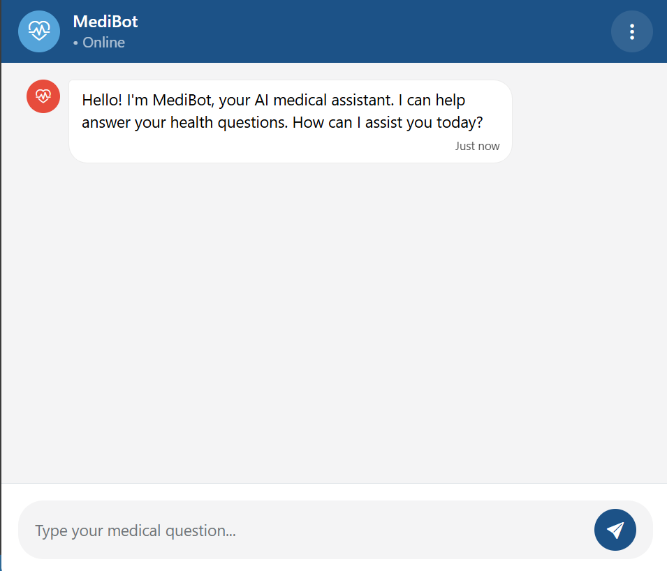
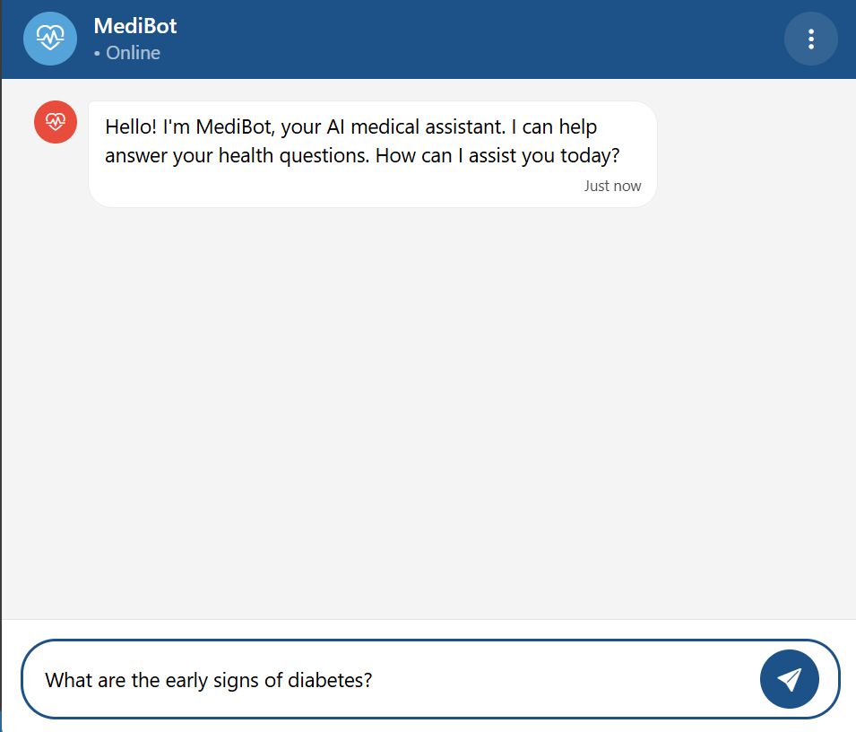
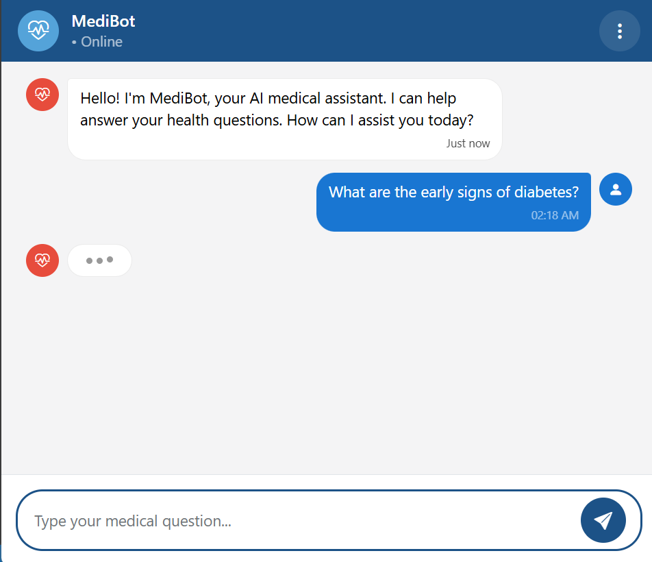
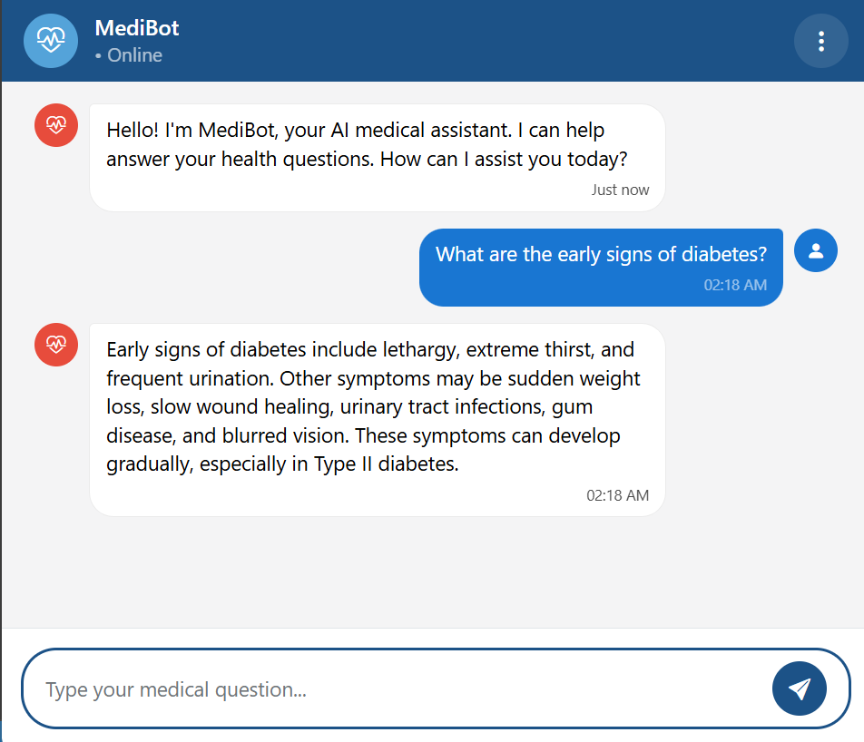
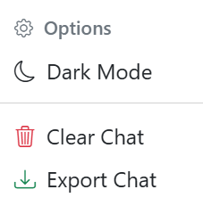
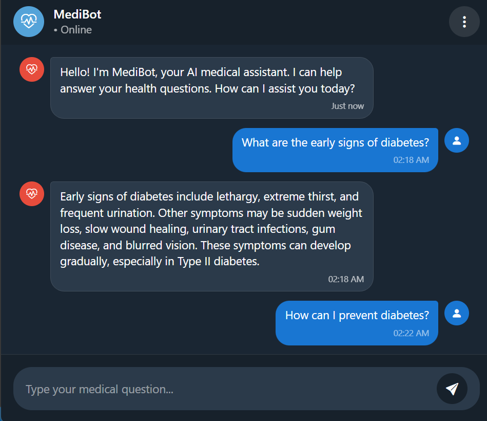
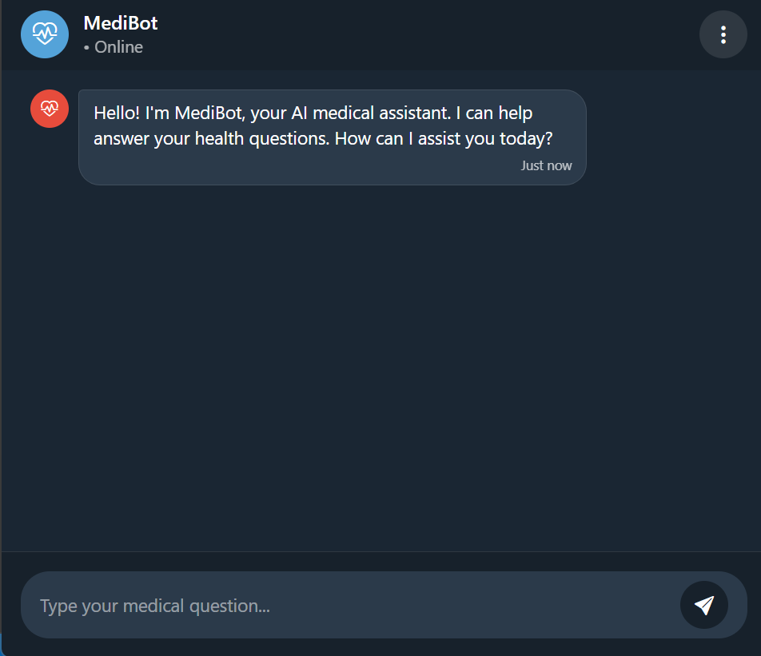

# MediBot - AI Medical Assistant 🏥

An AI-powered medical chatbot that provides accurate health information using RAG technology and a curated medical knowledge base.



## Features

- **AI-Powered Responses**: Uses OpenAI GPT-4 with RAG technology for accurate medical advice
- **Conversation Memory**: Maintains context throughout discussions for better understanding
- **Theme Support**: Dark/light mode toggle with persistent preferences
- **Responsive Design**: Optimized for desktop, tablet, and mobile devices
- **Chat Management**: Export conversation history and clear chat functionality

## Getting Started

### Prerequisites

- [pip](https://pip.pypa.io/en/stable/)
- [Conda](https://docs.conda.io/en/latest/miniconda.html) (for backend Python environment)
- [OpenAI API Key](https://platform.openai.com/account/api-keys) **or** a GitHub access token (see note below)
- [Pinecone API key](https://docs.pinecone.io/guides/projects/manage-api-keys)

> **Note:**  
> You can use a GitHub access token as the API key for the OpenAI client in this project.  
> See [here](https://github.com/marketplace/models/azure-openai/gpt-4o-mini) for more details.

### 1. Clone the Repository

```sh
git clone<repository-url>
cd medical-chatbot
```

### 2. Setup

1. **Create and activate a Conda environment:**

   ```sh
   conda create -n medibot python=3.10 -y
   conda activate medibot
   ```

2. **Install dependencies:**

   ```sh
   pip install -r requirements.txt
   ```

3. **Set up environment variables:**

   - Create a `.env` file in your project root:
     ```
     PINECONE_API_KEY=your_pinecone_api_key
     OPENAI_API_KEY=your_openai_api_key
     SECRET_KEY=your_flask_secret_key
     ```
     > **Note:** You can generate a secret key by running the `secret_key.py` file as follows and copy the key into `.env`:
     > ```bash
     > python secret_key.py
     > ```

4. **Initialize the vector database**
   ```bash
   python store_index.py
   ```

7. **Run the application**
   ```bash
   python app.py
   ```

8. **Access the chatbot**
   Open your browser and navigate to `http://localhost:8080`

## Tech Stack

- **Backend:** Flask, LangChain, Python 3.10
- **Frontend:** HTML5, CSS3, JavaScript ES6+, Bootstrap 5.3
- **Vector Database:** Pinecone
- **AI/ML:** OpenAI GPT-4o-mini, HuggingFace Vector Embeddings

## Usage

### **Starting a Conversation**

1. Open the MediBot interface in your browser


2. Type your medical question in the input field and click the send button


3. Wait for the AI to process and respond


4. Continue the conversation by asking more questions


### **Using Features**


- **Dark Mode**: Click the 3-dots menu → Dark Mode


- **Clear Chat**: Click the 3-dots menu → Clear Chat


- **Export Chat**: Click the 3-dots menu → Export Chat


### **Mobile Usage**
- The interface is fully responsive
- Touch-friendly buttons and inputs
- Optimized chat bubbles for smaller screens

## Medical Disclaimer

**Important**: MediBot is an AI assistant designed to provide general health information only. It is not a substitute for professional medical advice, diagnosis, or treatment. Always consult with qualified healthcare providers for medical concerns.
